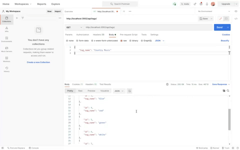
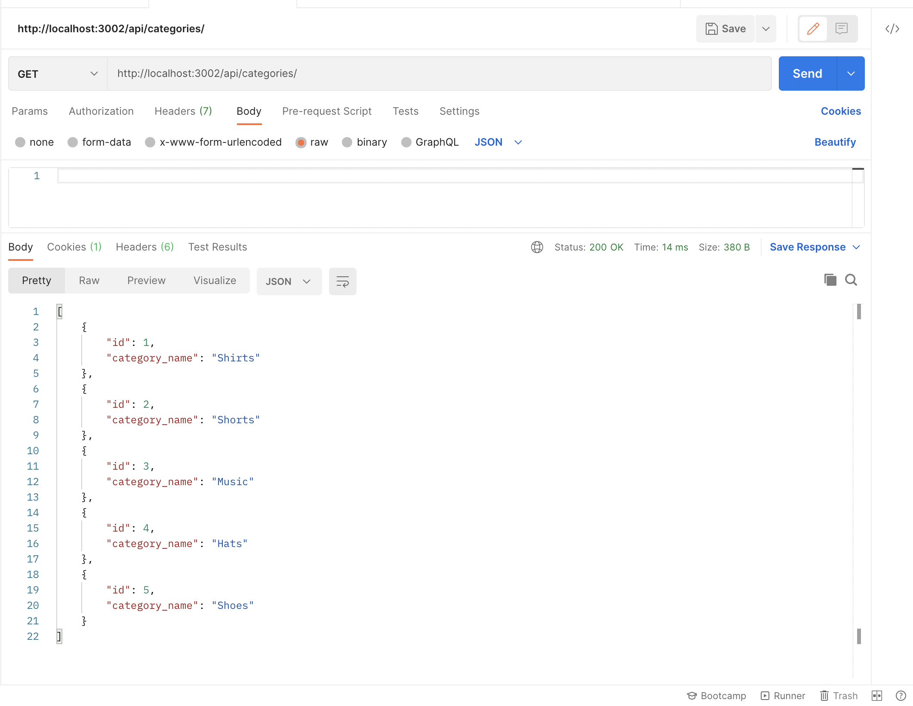
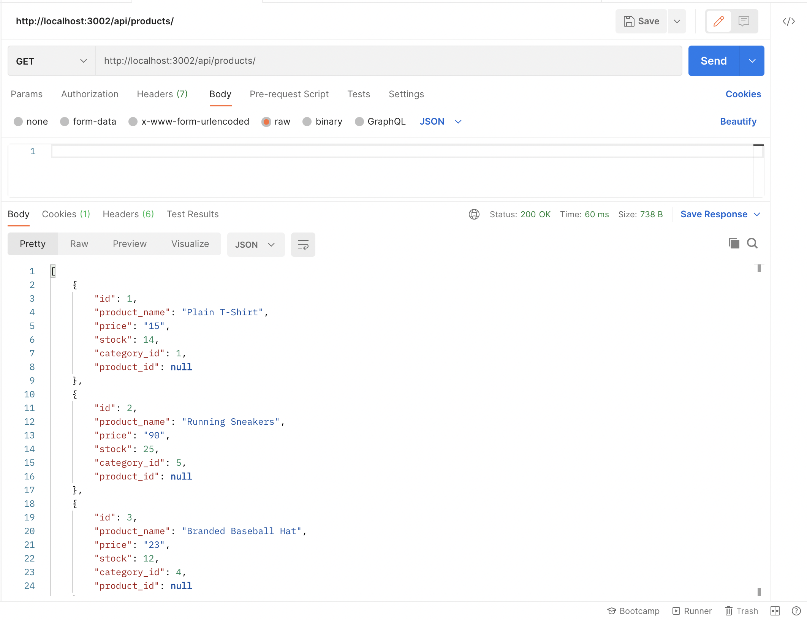

#       Commence Commerce

#       Description

        This application simulates the backend portion of an E-Commerce website. Express.js was used for the server, and MySQL for the database. Sequelize is used as the ORM to run SQL models and queries. The SQL database includes tables for products, categories, tags, and product tags. RESTful API routes are used to make requests and updates from the database which are joined through Sequelize queries.

#       Images

#       Video Link

[Application Video](https://youtu.be/UoeJUR1xPT4)

#       Languages Used

        *JavaScript
        *Node.js

#       Dependencies

        * MySQL2
        * Sequelize
        * Dotenv
        * Express

#       Installation 

        * Clone the repo link through your CLI
           * https://github.com/MarisaHanna/commence-commerce.git
        * Navigate to you root directory 
        * Run npm install
        * Run npm run seed
        * Run npm start

#       Contrubutors

        * Marisa Hanna
